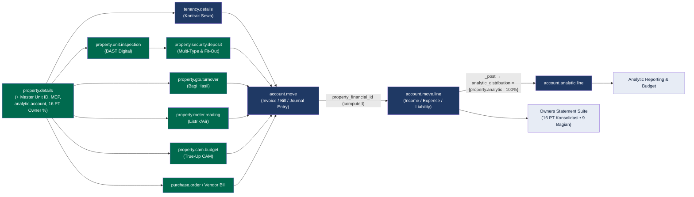
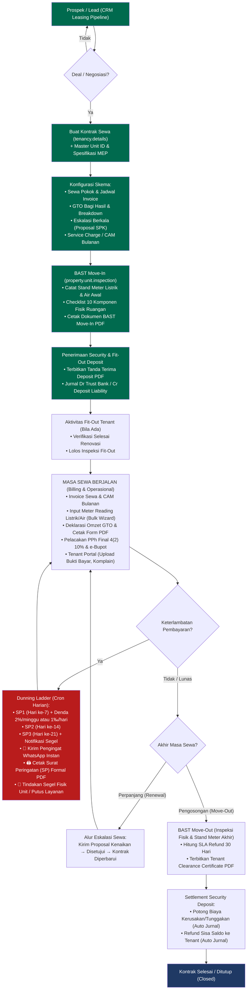
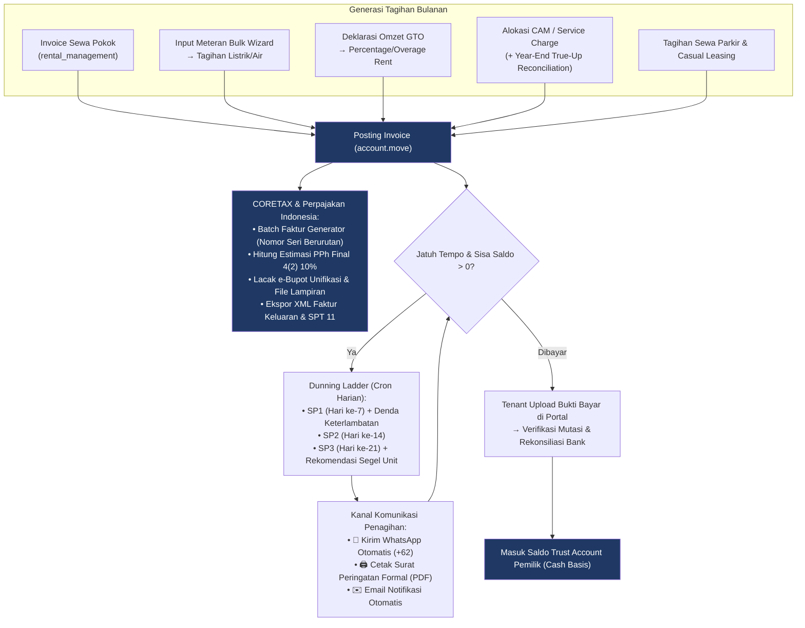
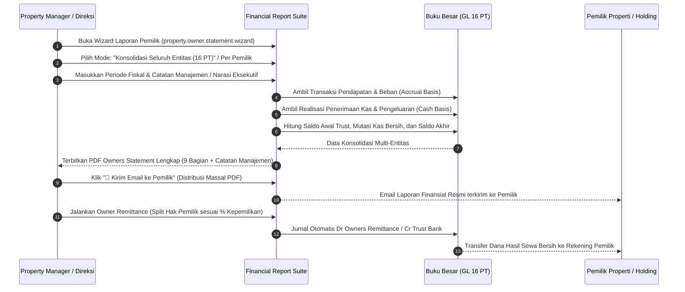

# Arsitektur Sistem & Alur Proses Bisnis
### Property Management System Odoo 19 — addon `rental_management` + 26 Modul Companion

> Diagram ditulis dalam **Mermaid** dan dirender otomatis oleh GitHub/IDE Markdown viewer.
> Dokumen ini menyajikan arsitektur lengkap, alur data, integrasi cross-cutting, dan proses bisnis end-to-end terkini (Tahap 1 s.d. Tahap 4).

---

## 1. Arsitektur Sistem (Layered Companion Architecture)

Pendekatan **companion-module non-invasif**: seluruh modul kustom berdiri di atas addon pihak ketiga `rental_management` (OPL-1) dan modul standar Odoo 19 Community Edition, tanpa memodifikasi kode sumber berlisensi secara langsung.

```mermaid
graph TD
    subgraph CLIENT["Lapisan Akses & Antarmuka"]
        WEB["Backend Web UI Odoo 19"]
        TPORTAL["Tenant Portal /my/contracts • /my/invoices • /my/maintenance"]
        OPORTAL["Owner Portal /my/properties • /my/statements"]
        WA["WhatsApp Click-to-Chat (62xxx)"]
        PDF["QWeb PDF Dokumen Resmi (BAST, SP, Clearance, Receipt, Statement)"]
        CORETAX_XML["Ekspor XML CORETAX DJP"]
    end

    subgraph CUSTOM["26 Modul Companion Kustom (100% Odoo 19 Community)"]
        direction TB
        FIN["financial_report<br/>Owners Statement (16 PT Konsolidasi) • Trust • Remittance<br/>Budget • Multi-Type Deposit • BAST Digital • Clearance"]
        OPS["Operasional: gto_meter • casual_leasing<br/>guarantee • handover • cam • parking"]
        TAX["coretax<br/>(Batch e-Faktur, PPh Final 4(2) 10%, SPT 11 Ekspor XML)"]
        ASSET["asset<br/>Depresiasi • Revaluasi • Sinkronisasi CORETAX L9"]
        AUTO["Otomasi & Penagihan: dunning (SP1-SP3, Segel)<br/>rent_escalation • insurance • lease_expiry • ppm"]
        MGMT["Manajemen & Eksekutif: dashboard (WALE, RevPAM)<br/>vacancy • valuation • access • esign"]
        INTG["Integrasi & Legal: purchase • crm • project<br/>document_ce (Legal ID) • portal • owner_portal"]
    end

    subgraph BASE["Addon Pihak Ketiga"]
        RM["rental_management (TechKhedut)<br/>property.details • tenancy.details<br/>maintenance.request"]
    end

    subgraph STD["Modul Standar Odoo 19 Community Edition"]
        ACC["account (Accounting + Analytic Plans)"]
        PUR["purchase"]
        CRM["crm"]
        PRJ["project"]
        PORT["portal"]
        MAIL["mail (Chatter, Activities, Mail Templates)"]
        PROD["product"]
        MAINT["maintenance"]
    end

    WEB --> CUSTOM
    TPORTAL --> PORT
    OPORTAL --> PORT
    WA --> CUSTOM
    CUSTOM --> PDF
    CUSTOM --> CORETAX_XML

    CUSTOM --> RM
    RM --> ACC
    RM --> MAINT

    FIN --> ACC
    OPS --> ACC
    OPS --> PROD
    TAX --> ACC
    ASSET --> ACC
    AUTO --> MAIL
    AUTO --> ACC
    INTG --> PUR
    INTG --> CRM
    INTG --> PRJ
    INTG --> PORT

    classDef custom fill:#1F3964,color:#fff,stroke:#11203a;
    classDef base fill:#006A4E,color:#fff,stroke:#024;
    classDef std fill:#E7ECF5,color:#11203a,stroke:#9bb;
    class FIN,OPS,TAX,ASSET,AUTO,MGMT,INTG custom;
    class RM base;
    class ACC,PUR,CRM,PRJ,PORT,MAIL,PROD,MAINT std;
```

---

## 2. Arsitektur Data — Rantai Atribusi Properti & Analitik Otomatis

Setiap dokumen keuangan ditelusuri ke **satu unit/properti** melalui `account.move.property_financial_id` (computed stored). Saat `account.move._post`, baris pendapatan/beban otomatis dicap **analytic account** properti → mengalir ke Owners Statement, laporan analitik, dan anggaran (budget).

---

## 3. Alur Bisnis E2E — Siklus Hidup Tenant Komersial

---

## 4. Alur Billing Bulanan, Pajak CORETAX & Dunning

---

## 5. Alur Tutup Periode — Owners Statement Konsolidasi 16 PT & Remittance

---

## 6. Daftar Modul Companion & Status Integrasi (26 Modul)

| # | Nama Modul | Fungsi Utama | Status |
|---|------------|--------------|--------|
| 1 | `rental_management_financial_report` | Owners Statement Suite (9 Section), Konsolidasi 16 PT, Trust Accounting, Remittance, Budget, Multi-Type Deposit, BAST Digital, Tenant Clearance Certificate, Master Unit ID & MEP. | ✅ Aktif & Terverifikasi |
| 2 | `rental_management_dunning` | Dunning Ladder SP1-SP3, Denda Keterlambatan (2%/minggu, 1‰/hari), Penyegelan Unit, Notifikasi WhatsApp, Cetak SP Formal PDF, Cron Harian. | ✅ Aktif & Terverifikasi |
| 3 | `rental_management_coretax` | Integrasi Pajak Indonesia CORETAX DJP, Batch Update Faktur Pajak Berurutan, Pelacakan PPh Final 4(2) 10% & e-Bupot, Ekspor XML SPT 11. | ✅ Aktif & Terverifikasi |
| 4 | `rental_management_gto_meter` | GTO Revenue Sharing (Higher-of, Base+Overage, Pure), Formulir Pernyataan Omzet PDF, Bulk Meter Reading Wizard, Cron Bulanan Engineering. | ✅ Aktif & Terverifikasi |
| 5 | `rental_management_portal` | Tenant Self-Service: Upload Bukti Transfer Bank, Riwayat BAST & Stand Meter, Pengajuan Komplain & Maintenance Tiket, Lihat Invoice. | ✅ Aktif & Terverifikasi |
| 6 | `rental_management_dashboard` | Dashboard Eksekutif: Metrik WALE (Tahun/Bulan), RevPAM (Pendapatan/m²), Occupancy Rate %, Arrears Aging, NOI, Collection Rate. | ✅ Aktif & Terverifikasi |
| 7 | `rental_management_cam` | CAM / Service Charge Apportionment, Budgeting, dan Year-End True-Up Reconciliation (Balancing Invoices & Credit Notes). | ✅ Aktif & Terverifikasi |
| 8 | `rental_management_rent_escalation` | Otomasi Kenaikan Sewa Berkala (Fixed %, Index), Alur Pengajuan Proposal Kenaikan Sewa & Persetujuan Manajemen. | ✅ Aktif & Terverifikasi |
| 9 | `rental_management_document_ce` | Manajemen Perizinan & Dokumen Legal Properti Indonesia (SHM/HGB, IMB/PBG, SLF, PBB, PKS, NPWP, AMDAL, Damkar) — 100% Community. | ✅ Aktif & Terverifikasi |
| 10 | `rental_management_owner_portal` | Portal Mandiri Pemilik Unit: Akses Owners Statement, Laporan Remittance, dan Portofolio Properti. | ✅ Aktif & Terverifikasi |
| 11 | `rental_management_casual_leasing` | Penyewaan Area Kasual / Booth / Pop-up Store / Atrium / Spanduk dengan alokasi otomatis. | ✅ Aktif & Terverifikasi |
| 12 | `rental_management_guarantee` | Register Bank Guarantee & Security Deposit Insurance untuk jaminan sewa tenant komersial. | ✅ Aktif & Terverifikasi |
| 13 | `rental_management_handover` | Modul Serah Terima Unit dengan integrasi Project/Task Odoo. | ✅ Aktif & Terverifikasi |
| 14 | `rental_management_parking` | Manajemen Slot Parkir Gedung, Alokasi Tenant, dan Tagihan Parkir Berkala. | ✅ Aktif & Terverifikasi |
| 15 | `rental_management_insurance` | Manajemen Polis Asuransi Gedung (Property All Risks, Public Liability) & Notifikasi Perpanjangan. | ✅ Aktif & Terverifikasi |
| 16 | `rental_management_lease_expiry` | Pelacakan Kontrak Mendekati Jatuh Tempo & Pengingat Perpanjangan Otomatis. | ✅ Aktif & Terverifikasi |
| 17 | `rental_management_ppm` | Preventive Maintenance Scheduling & Checklist Pemeliharaan Gedung Berkala. | ✅ Aktif & Terverifikasi |
| 18 | `rental_management_vacancy` | Papan Ketersediaan Unit (Vacancy Board) & Analisis Tingkat Kekosongan Ruangan. | ✅ Aktif & Terverifikasi |
| 19 | `rental_management_valuation` | Buku Penilaian Nilai Pasar Properti (Market Valuation) Berkala. | ✅ Aktif & Terverifikasi |
| 20 | `rental_management_access` | Manajemen Kartu Akses Tenant & Registrasi Pengunjung Gedung. | ✅ Aktif & Terverifikasi |
| 21 | `rental_management_esign` | Integrasi Tanda Tangan Digital untuk Surat Perjanjian & Dokumen BAST. | ✅ Aktif & Terverifikasi |
| 22 | `rental_management_purchase` | Integrasi Pengadaan Barang/Jasa Maintenance ke Purchase Order & Vendor Bill ter-tag properti. | ✅ Aktif & Terverifikasi |
| 23 | `rental_management_crm` | Pipeline Leasing CRM untuk pengelolaan prospek tenant dari Lead hingga Kontrak Sah. | ✅ Aktif & Terverifikasi |
| 24 | `rental_management_project` | Integrasi Manajemen Proyek Fit-Out & Renovasi Gedung. | ✅ Aktif & Terverifikasi |
| 25 | `rental_management_asset` | Manajemen Fixed Asset Properti, Depresiasi, Revaluasi Aset, dan Sinkronisasi CORETAX L9. | ✅ Aktif & Terverifikasi |
| 26 | `rental_management_documents` | Integrasi Dokumen Properti (dengan fallback penuh ke `rental_management_document_ce` di Community). | ✅ Aktif & Terverifikasi |
