# Arsitektur Sistem & Alur Proses Bisnis
### Property Management System Odoo 19 — addon `rental_management` + 26 modul companion

> Diagram ditulis dalam **Mermaid** dan dirender otomatis oleh GitHub.
> Dokumen ini melengkapi `Blueprint_Installation_Configuration.docx` dan `INTEGRATIONS.md`.

---

## 1. Arsitektur Sistem (Layered)

Pendekatan **companion-module non-invasif**: modul kustom berdiri di atas addon
pihak ketiga `rental_management` (OPL-1) dan modul standar Odoo, tanpa menambal
kode berlisensi.

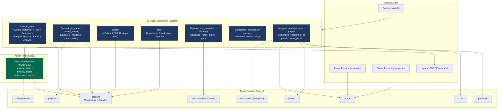

---

## 2. Arsitektur Data — Rantai Atribusi Properti

Setiap dokumen keuangan ditelusuri ke **satu properti** melalui
`account.move.property_financial_id` (computed). Saat `account.move._post`,
item income/expense otomatis dicap **analytic account** properti → mengalir ke
Owners Statement, reporting analitik, dan budget standar Odoo.

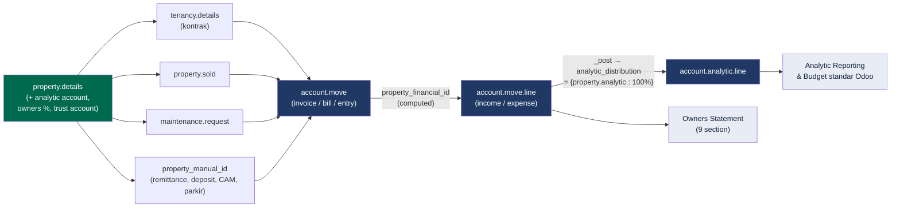

---

## 3. Alur Bisnis E2E — Siklus Hidup Tenant

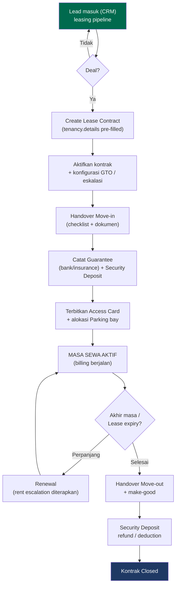

---

## 4. Alur Billing Bulanan & Penagihan

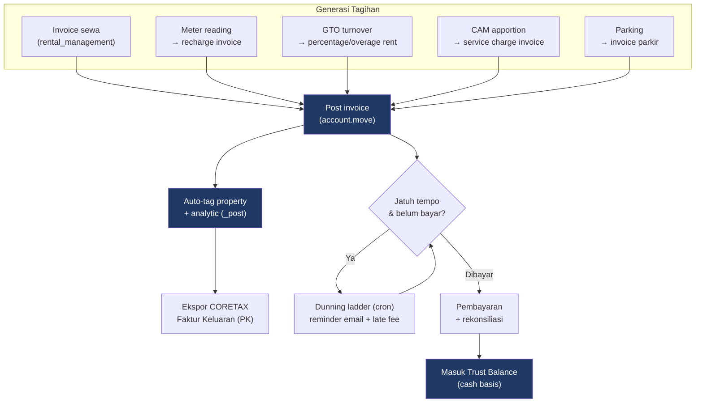

---

## 5. Alur Pengeluaran — Procurement & Maintenance

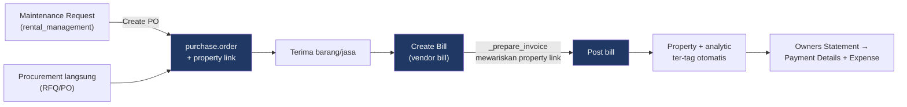

---

## 6. Alur Tutup Periode — Owners Statement, Trust & Remittance

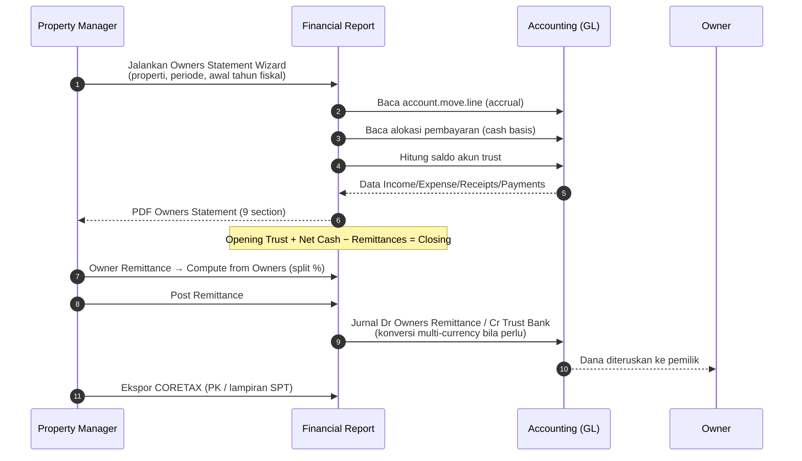

---

## 7. Alur Fixed Asset — Depresiasi & Revaluation

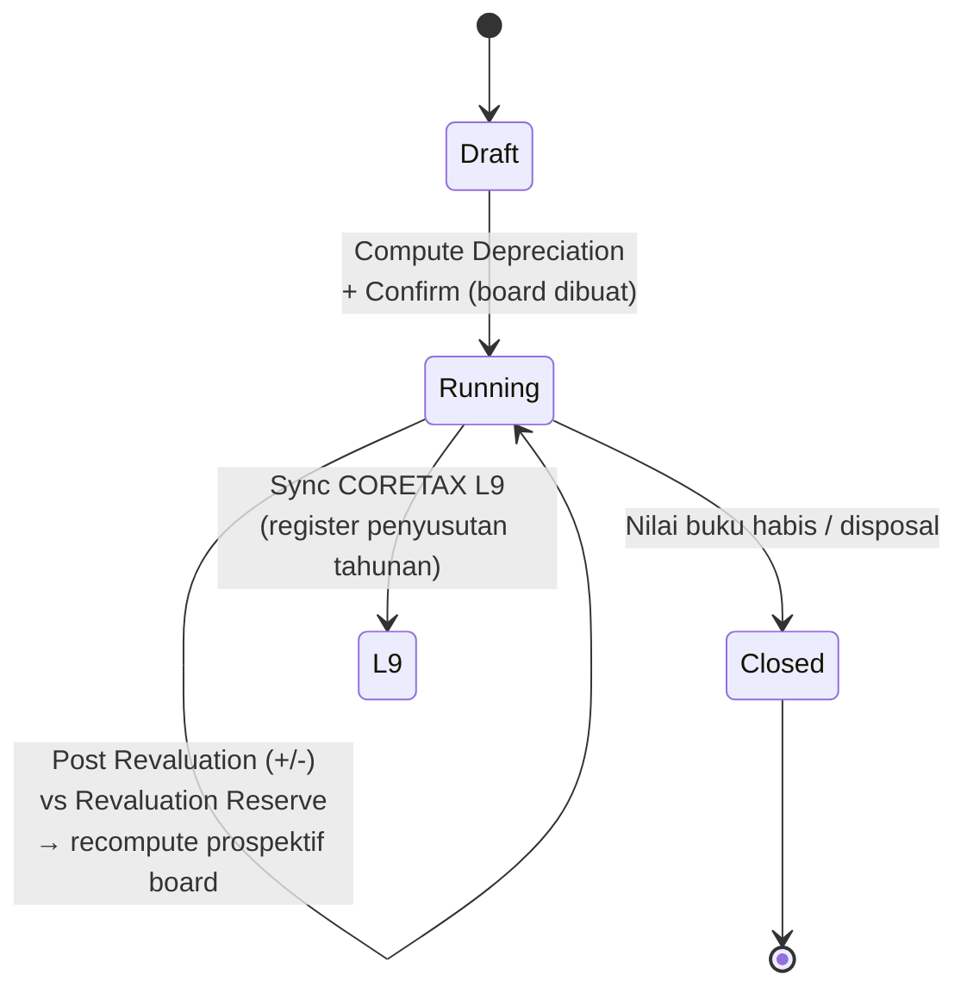

---

## 8. Integrasi Cross-Cutting — Analytic Accounting

Satu override global (`account.move._post`) membuat **seluruh** dokumen
ber-link properti dari modul manapun otomatis ter-tag analitik — tanpa langkah
tambahan per modul.

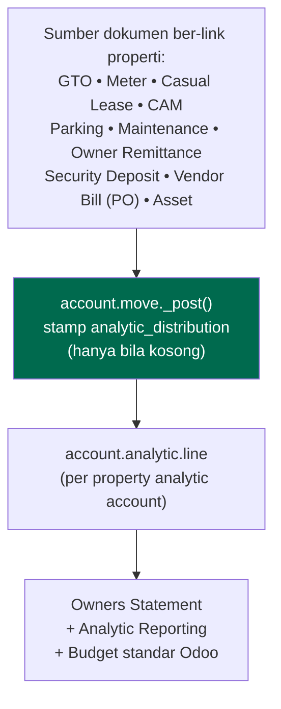

---

### Catatan
- Semua diagram bersifat **logis/fungsional**; nama field & hook mengikuti kode pada branch `claude/gallant-curie-dpaatp`.
- Integrasi bersifat **decoupled** — modul memeriksa keberadaan field (mis. `property_manual_id`) sebelum memakainya, sehingga tiap modul dapat diinstal independen.
- Validasi: sintaks Python/XML/CSV ✅; **smoke test pada Odoo 19 staging tetap wajib** sebelum produksi.

---

## Versi Gambar (PNG)

Versi PNG resolusi tinggi (scale 2×) tersedia di `docs/diagrams/` untuk dipakai
pada slide presentasi / dokumen cetak:

| # | Diagram | File |
|---|---------|------|
| 1 | Arsitektur Sistem (Layered) | `diagrams/01-arsitektur-sistem.png` |
| 2 | Arsitektur Data — Atribusi Properti | `diagrams/02-arsitektur-data.png` |
| 3 | Siklus Hidup Tenant (E2E) | `diagrams/03-siklus-hidup-tenant.png` |
| 4 | Billing Bulanan & Penagihan | `diagrams/04-billing-penagihan.png` |
| 5 | Pengeluaran (Procurement & Maintenance) | `diagrams/05-pengeluaran.png` |
| 6 | Tutup Periode (Owners Statement, Trust, Remittance) | `diagrams/06-tutup-periode.png` |
| 7 | Fixed Asset — Depresiasi & Revaluation | `diagrams/07-fixed-asset.png` |
| 8 | Integrasi Cross-Cutting Analytic | `diagrams/08-analytic-crosscutting.png` |

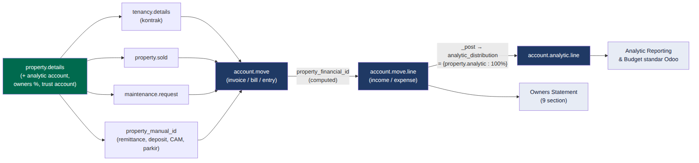

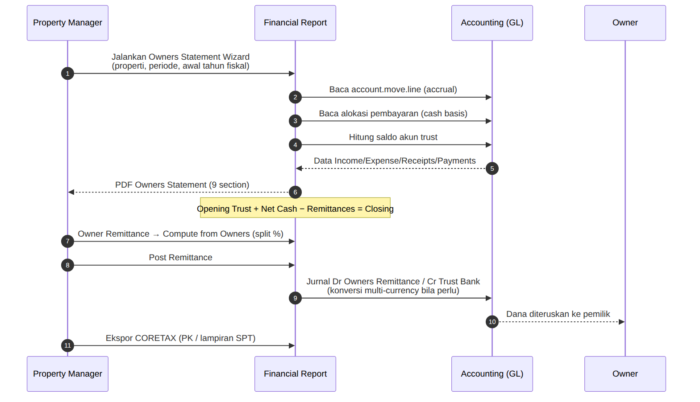
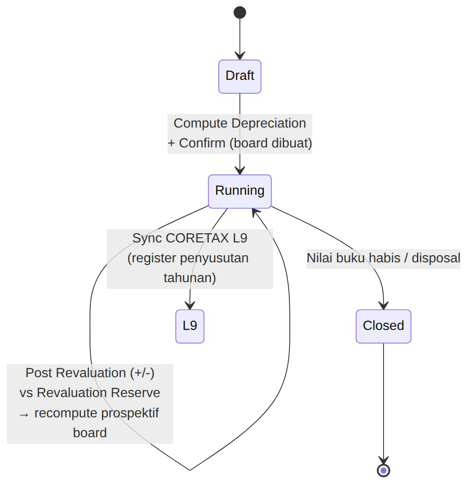

